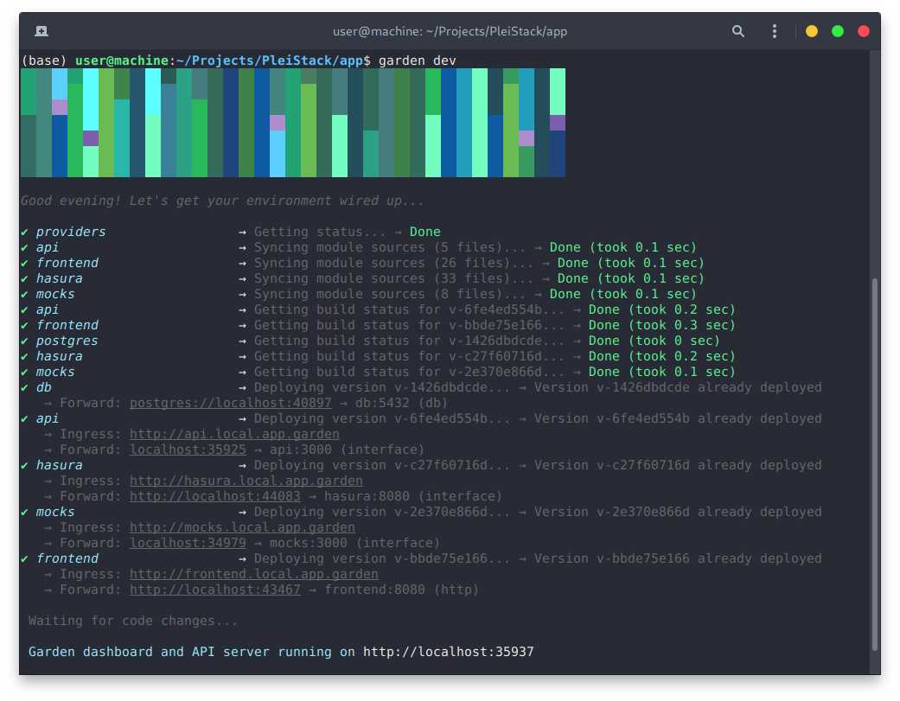
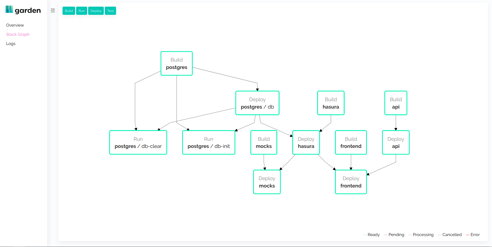

# Overview

Development can be done in one of two ways, depending on a dev's preference and machine capabilities:

- A local setup allows offline-development and is less expensive due to not needing a per-developer service namespace in Kubernetes, but requires more configuration and that the host machine be running a k8s cluster, which is unfeasible for very low-power machines like Chromebooks.

- Conversely, remote setup allows very rapid onboarding, but can be more costly, and cannot be done in the event that no internet is available.

## Local (Offline-capable)

This method requires that a developer have a local Kubernetes cluster running. Solutions such as Microk8s, Minikube, and KIND (Kuberenetes in Docker) make this possible with minimal resource usage for local development. The guide presented here assumes the use of Microk8s.

Bash scripts (for Ubuntu) to install and configure needed dependencies have been provided under the `/config-scripts` directory. The order in which they should be ran, and explanations of each script, are as follows:

1. <a href="https://raw.githubusercontent.com/GavinRay97/hasura-ultimate-starter/master/config-scripts/install-docker.sh" target="_blank">🔗</a> `install-docker.sh`

   - Downloads and installs Docker through `curl`

2. <a href="https://raw.githubusercontent.com/GavinRay97/hasura-ultimate-starter/master/config-scripts/configure-docker.sh" target="_blank">🔗</a> `configure-docker.sh`

   - Configures Docker so that it can run as a non-root user. This is required for compatibility with Garden and Microk8s. After running this script, a reboot will be required for the usermod change to take effect.

3. <a href="https://raw.githubusercontent.com/GavinRay97/hasura-ultimate-starter/master/config-scripts/install-kubectl.sh" target="_blank">🔗</a> `install-kubectl.sh`

   - Downloads `kubectl` through `curl`

4. <a href="https://raw.githubusercontent.com/GavinRay97/hasura-ultimate-starter/master/config-scripts/configure-kubectl.sh" target="_blank">🔗</a> `configure-kubectl.sh`

   - Configures `kubectl` with executable permissions and moves it from the current directory to `/usr/local/bin` so it is available through shell.

5. <a href="https://raw.githubusercontent.com/GavinRay97/hasura-ultimate-starter/master/config-scripts/install-microk8s.sh" target="_blank">🔗</a> `install-microk8s.sh`

   - Installs Microk8s through the Snap store and enables the `dns` and `registry` addons for it.

6. <a href="https://raw.githubusercontent.com/GavinRay97/hasura-ultimate-starter/master/config-scripts/configure-microk8s.sh" target="_blank">🔗</a> `configure-microk8s.sh`

   - Genereates a `KUBECONFIG` file for `kubectl` to use Microk8s and sets the `kubectl` context to `microk8s`, and configures Microk8s so that it can run as a non-root user. This is required for things to function properly, and a reboot will be required for the usermod change to take effect.

7. <a href="https://raw.githubusercontent.com/GavinRay97/hasura-ultimate-starter/master/config-scripts/install-garden.sh" target="_blank">🔗</a> `install-garden.sh`

   - Downloads and installs the `garden` binary via `curl`

8. (Utility) <a href="https://raw.githubusercontent.com/GavinRay97/hasura-ultimate-starter/master/config-scripts/regenerate-microk8s-kubeconfig.sh" target="_blank">🔗</a> `regenerate-microk8s-kubeconfig.sh`

   - This script generates a fresh `KUBECONFIG` file at `~/.kube/config` that is pre-configured to connect to local Microk8s. Use in the event that `kubectl` is unable to detect or communicate with Microk8s.

After all of the above, you should have the ability to develop locally with Kubernetes. Now, we can launch and bootstrap our application service stack through Garden.

## Remote

This method uses Garden to create a two-way file sync between a service's local files and the service's files in it's k8s cluster. By default, Garden is configured to provide each developer with their own cluster namespace using their machine's user account name. You can see this in the project-level `garden.yaml` under the `namespace` key for `providers`:

```yaml
providers:
  - name: kubernetes
    environments: [remote]
    context: gke_appname_us-central1-a_standard-cluster-1
    namespace: ${local.env.USER || local.username}-appname
    defaultHostname: ${local.env.USER || local.username}-appname.dev-1.sys.garden
```

In addition to the file sync, it will also create ingress points and local forwarding so that services can be accessed from outside of the cluster. The ingress URL's are configured in each service's `garden.yaml`. The convention followed here is `http://<service-name>.local.app.garden`

```yaml
services:
  - name: hasura
  ...
    ingresses:
      - path: /
        port: interface
        hostname: hasura.local.app.garden
```

?> **Note:** Accessing services from other services in the cluster follows the URL scheme <br> `http://<service-name>` <br> You may have to explicitly provide a port-name in some instances for requests to be successful <br> `http://<service-name>:8080`

For remote development, the only requirements are the steps pertaining to installing & configuring `garden` and `kubectl` above. You will also need to configure access to your remote cluster within `kubectl` by following the respective providers' guide. [**The guide for GKE can be found and followed here.**](https://docs.garden.io/guides/cloud-provider-setup#gke-google)

!> **Note:** Make certain that your `context` key under the `remote` provider in your project-level `garden.yaml` is the same as your `kubectl` context remote cluster name. Do this by running `kubectl config current-context` and checking the result matches the value in the config file.

## Start Developing

After one of the following setup guides above has been successfully completed, the service stack can be spawned and development begun by running `garden dev` (local) or `garden dev --env=remote` (remote) from the directory containing the project-level `garden.yaml`. This will also launch the Garden web dashboard, which you can access from the link Garden provides in it's terminal logs.




